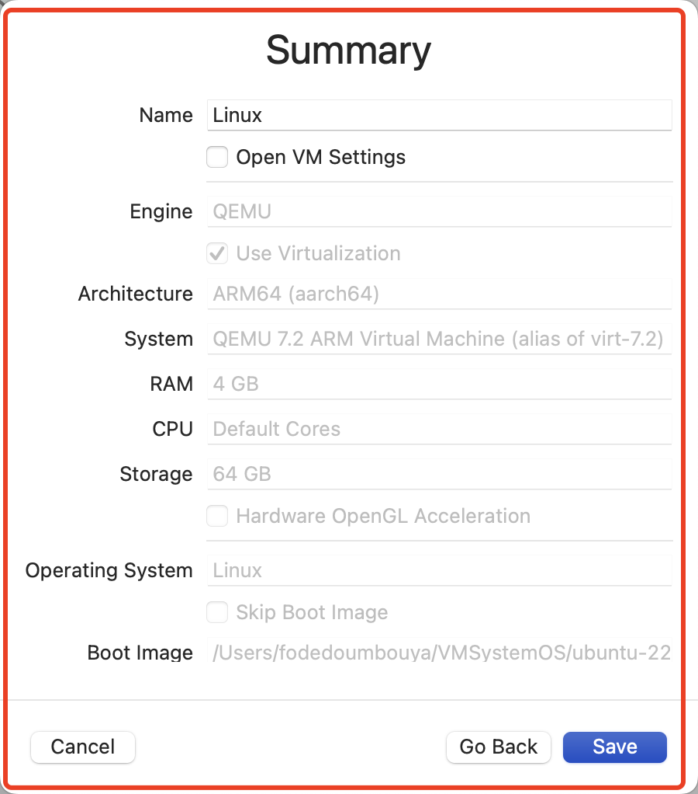

- L'installation d'Ubuntu sur un logiciel UTM (Unified Threat Management)
	- Téléchargez l'image ISO d'Ubuntu à partir du site officiel
	- 
	-
	- installez le logiciel UTM sur votre machine
	- 
	- 
	- 
	  
	- 
	-
	- Démarrez la machine virtuelle et démarrez à partir de l'image ISO d'Ubuntu.
	- 
- 
-
- Installation est fini 
  
  
-
- 
-
-